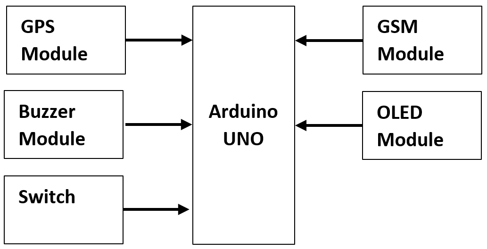
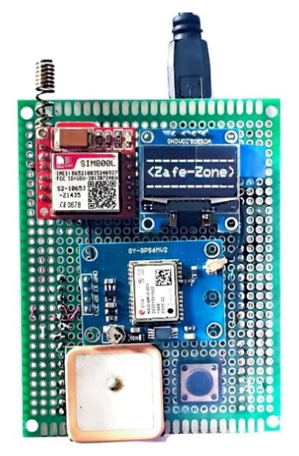

# Zafezone - Arduino

Base Microprocessor: Arduino UNO

Other modules:

- GPS Module
- GSM Module
- Buzzer Module
- OLED Module
- Switch

## Architecture

## Physical Device

- GSM Module: Red-colored SIM800L (top-left corner)
- OLED Module: White on black display
- Switch/Button: Black tap-key for emergencies
